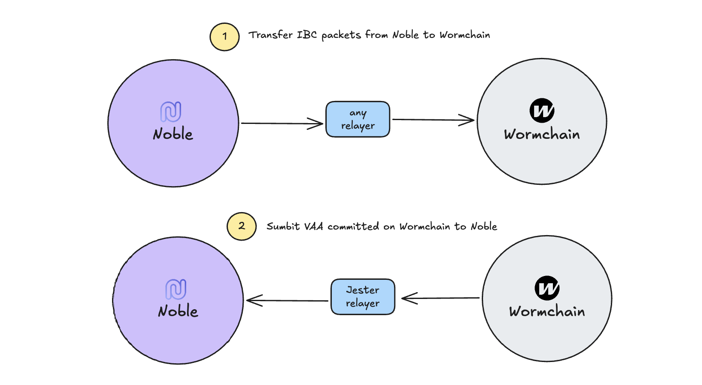

# `x/wormhole`

This repository contains a native Cosmos SDK module that enables Noble's
connection to Wormhole.

The module represents a GO implementation of the [`wormholeIbc`][`wormholeIbc`]
CosmWasm smart contract that is deployed on Cosmos zones connected with the
Wormchain like Neutron, Injective, and Sei.

The `x/wormhole` mdule serves three primary functions:

- **Governance synchronization**: process Wormhole governance actions into Noble
  to keep the current view of the chain in sync with the status of the protocol.
- **Cross-chain message verification**: allow Noble's modules to verify Wormhole
  Verifiable Action Approvals (VAAs).
- **Cross-chain communication**: allow Noble's module to send packets via the
  Wormhole network to other chains.

## Architecture Overview


Noble connects with the Wormhole network via Wormchain, their purpose built
Cosmos SDK blockchain. Wormchain implements a standardized protocol, as detailed
in the [whitepaper][whitepaper], which enables Cosmos zones to emit messages for
verification without the need for the guardian set to support each zone
directly.

The communication between Noble and Womchain follws two primary paths, as
illustrated in the diagram below:



- **Message pubblciation**: Noble can post messages to Wormchain, which are then
  propagated through the Wormhole network. This communication path is used to
  execute actions or trigger state changes into other chains supported by
  Wormhole. Any standard IBC relayer listening for packets can transfer these
  messages.

- **VAA Processing**: Noble can receive and verify VAAs commited on Wormchain.
  This communication path is used to update the Noble chain based on a state
  change happened into another chain. For this step, we use a custom relayer
  implementation called [Jester] which is run as a sidecar by Noble's
  validators.

These bidirectional communication paths enable secure cross-chain message
passing and verification, forming the foundation of Noble's integration with the
broader Wormhole ecosystem. Noble's modules can interact with the `x/wormhole`
module to perform actions on other chains that does not implement the IBC
protocol.

Noble and Wormchain communicates via a custom channel with version
`ibc-wormhole-v1` and a port exposed by their
[`wormchainIbcReceiver`][`wormchainIbcReceiver`] CosmWasm smart contract.

Once opened, this channel allows a custom packet to be sent from Noble to
Wormchain. This packet enable us to emit messages to Wormhole's guardian set,
who are listening to these packets. In general, these packets take the following
format:

```json
{
  "publish": {
    "msg": [
      {
        "key": "...",
        "value": "..."
      },
      ...
    ]
  }
}
```

Once these packets have been relayed to Wormchain via IBC, the guardian set
emits a VAA once consensus is reached.

### Governance Packets

On top of sending packets, the module exposes a custom transaction that allows
Wormhole governance actions to be submitted on Noble. This message is
permissionless, allowing any user to submit these packets once they are emitted
by Wormhole's guardian set.

Wormhole takes a `module / action` approach to governance, allowing them to
easily distinguish different governance actions across their various
implementations and infrastructure. The module currently implements and can
execute the following packets:

| Module        | Action               |
| ------------- | -------------------- |
| `Core`        | `GuardianSetUpgrade` |
| `IbcReceiver` | `UpdateChannelChain` |

[`wormholeIbc`]: https://github.com/wormhole-foundation/wormhole/tree/main/cosmwasm/contracts/wormhole-ibc
[`wormchainIbcReceiver`]: https://github.com/wormhole-foundation/wormhole/tree/main/cosmwasm/contracts/wormchain-ibc-receiver
[whitepaper]: https://github.com/wormhole-foundation/wormhole/blob/main/whitepapers/0012_ibc_generic_messaging.md
[jester]: https://github.com/noble-assets/jester
